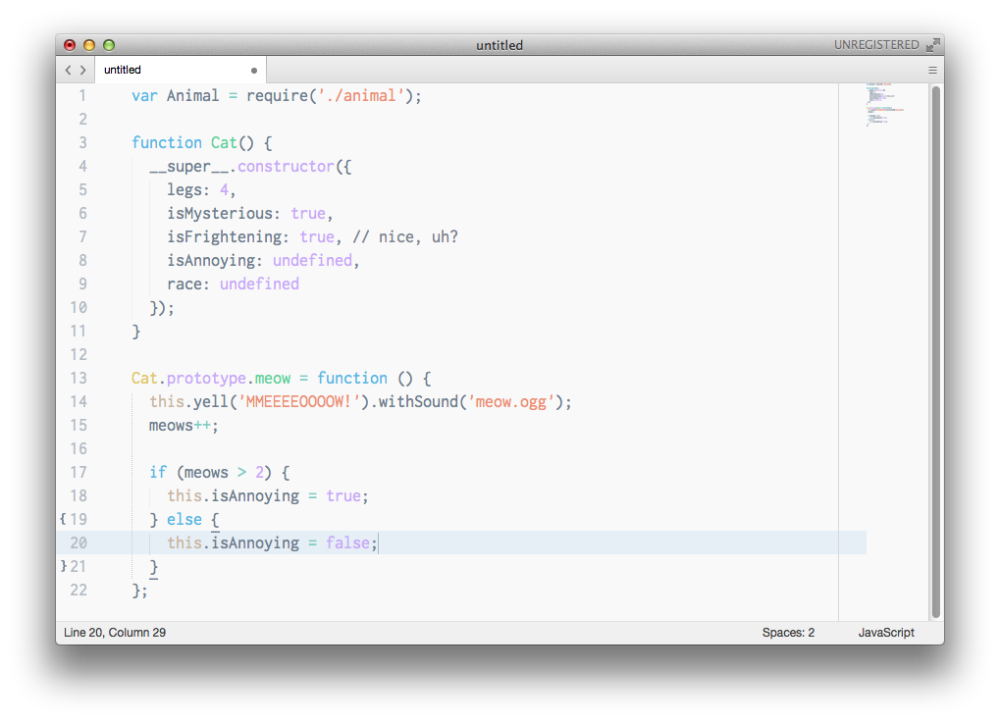

# Behave Light Theme

This is a fork of the [original](https://github.com/fnky/behave-theme) Behave color scheme.

I felt like it needed a light counterpart. Have fun :)

## TextMate

Simply copy the `.tmTheme` file to `~/Library/Application Support/TextMate/Themes`

## Sublime Text

Simply

    git clone https://github.com/nandobang/behave-light-theme

into your Package Control folder. You can find that through Sublime Text under `Preferences > Browse Packages...` or the Command Palette and copy the `.tmTheme` to Packages.
